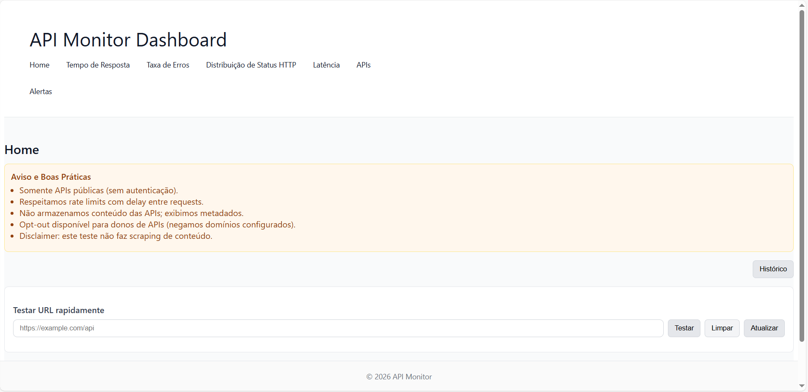

# API-MonitorDashboard

[](https://www.typescriptlang.org/)
[](https://reactjs.org/)
[](https://python.org)
[](https://opensource.org/licenses/MIT)
[](https://docs.docker.com/compose/)
[](https://nodejs.org/)
[](https://flask.palletsprojects.com/)
[](https://postgresql.org)
[](https://redis.io)

**Sistema fullstack para monitoramento de performance e disponibilidade de APIs públicas.**



## Recursos

- **Monitoramento em tempo real** de múltiplas APIs
- **Métricas de performance**: response time, uptime, error rate
- **Visualização de conteúdo** das APIs monitoradas
- **Sistema de alertas** configurável
- **Gráficos e histórico** de métricas
- **Containerizado** com Docker Compose

## Arquitetura
Frontend (React) → API Gateway (Node.js) → Monitor Service (Flask) → PostgreSQL + Redis


## Como Rodar

```bash
cp .env.example .env
# Edite o .env com valores 

docker-compose up --build

Serviços:
# Frontend: http://localhost:4173
# API Gateway: http://localhost:3001
# Monitor Service: http://localhost:5000
# PostgreSQL: http://localhost:5432
# Redis: http://localhost:6379